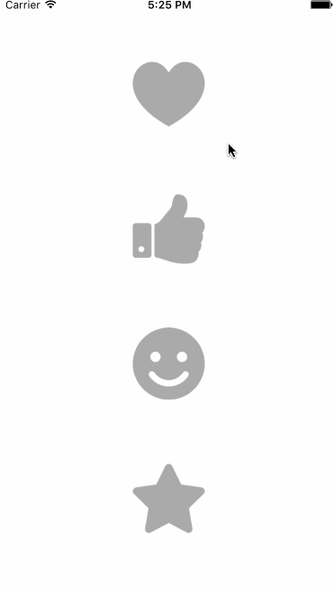

 ZXSunShine
=============

[](https://github.com/HLzhongxiao)
[](https://github.com/HLzhongxiao)

Beautiful radiation effects for iOS

> **Now ZXSunShine was updated version to 1.X , If you have any question or suggestion , welcome to 
tell me !**

## introduction

ZXSunShine is an animation of emission effects for IOS, which contains bright effects.

You can also find the swift version of this [here](https://github.com/imwcl/WCLShineButton).

## Demo



## Usage

```Objective-C

  ZXShineButton *button = [ZXShineButton makeShineButton:^(ZXShineButton *button) {
  
        // Button configuration
        button.frame = CGRectMake(0, 0, 80, 80);
        button.center = self.view.center;
        button.backgroundColor = [UIColor clearColor];
        button.image = heart;
        
    } andParams:^(ZXShineParams *params) {
    
        // Animation property assignment
        params.shineCount = 15;
        params.smallShineOffsetAngle = -5;
        params.allowRandomColor = true;
        
    }];
    
    [button addTarget:self action:@selector(btnClick) forControlEvents:UIControlEventTouchUpInside];
    [self.view addSubview:button];
    
```

## **Animation properties Usage**

| **Property**            | **Description**                          |
| ----------------------- | ---------------------------------------- |
| `fillColor`             | Fill button color                        |
| `allowRandomColor`      | Allow shine color random                 |
| `animDuration`          | shine anim duration                      |
| `bigShineColor`         | big shine color                          |
| `enableFlashing`        | Enable effect like flash                 |
| `shineCount`            | shine count around button                |
| `shineTurnAngle`        | turn angle of shine                      |
| `shineDistanceMultiple` | multiple of distance to button           |
| `smallShineOffsetAngle` | angle offset of small shine to big shine |
| `smallShineColor`       | small shine color                        |
| `shineSize`             | size of shine by pixel                   |
| `colorRandom`           | shine color random                       |
| `image`                 | button image (png)                       |

